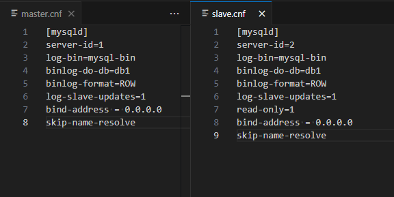
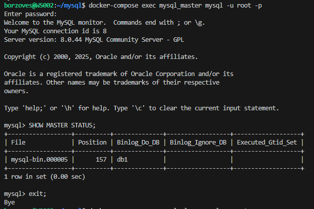
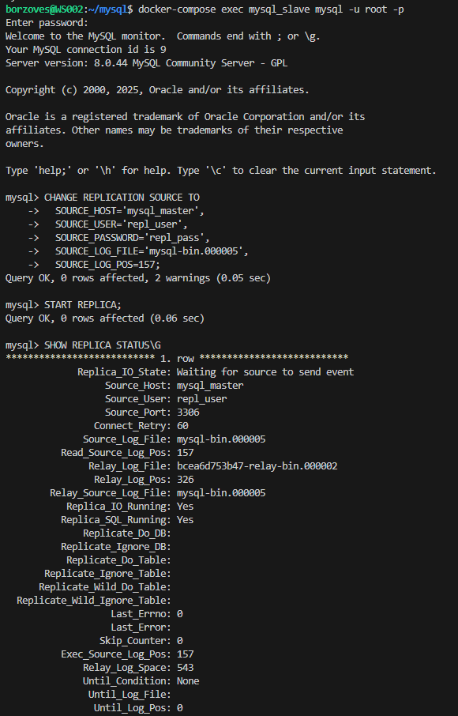

# Домашнее задание к занятию «Репликация и масштабирование. Часть 1 - Евгений Борзов»

### Задание 1

На лекции рассматривались режимы репликации master-slave, master-master, опишите их различия.

Мастер-мастер позволяет записывать данные во все реплицируемые БД, мастер-слейв - только в основную, остальные копии доступны только для чтения.
Мастер-слейв надежнее, но может быть узким местом при большом объеме записываемых данных.
Мастер-мастер позволяет распределить запись данных, но требует сложной настройки во избежание конфликтов и ошибок.

---

### Задание 2

Выполните конфигурацию master-slave репликации, примером можно пользоваться из лекции.

*Приложите скриншоты конфигурации, выполнения работы: состояния и режимы работы серверов.*

